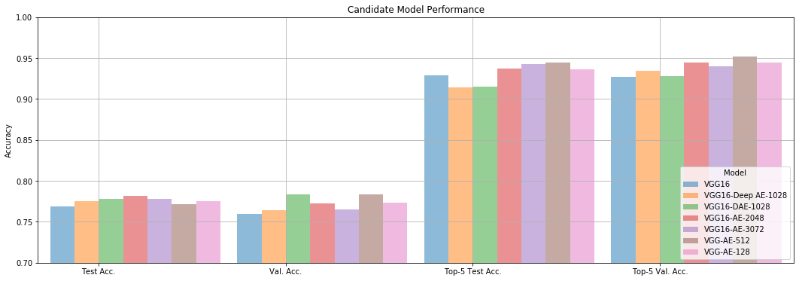
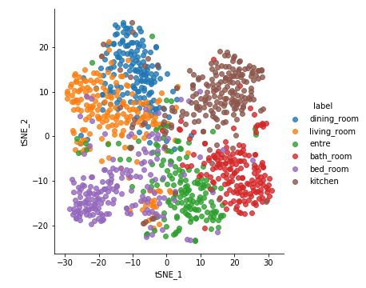
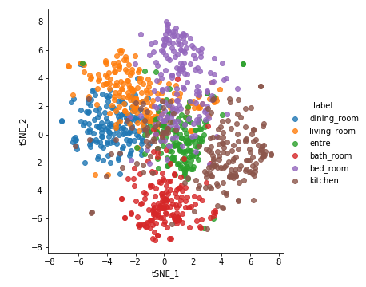
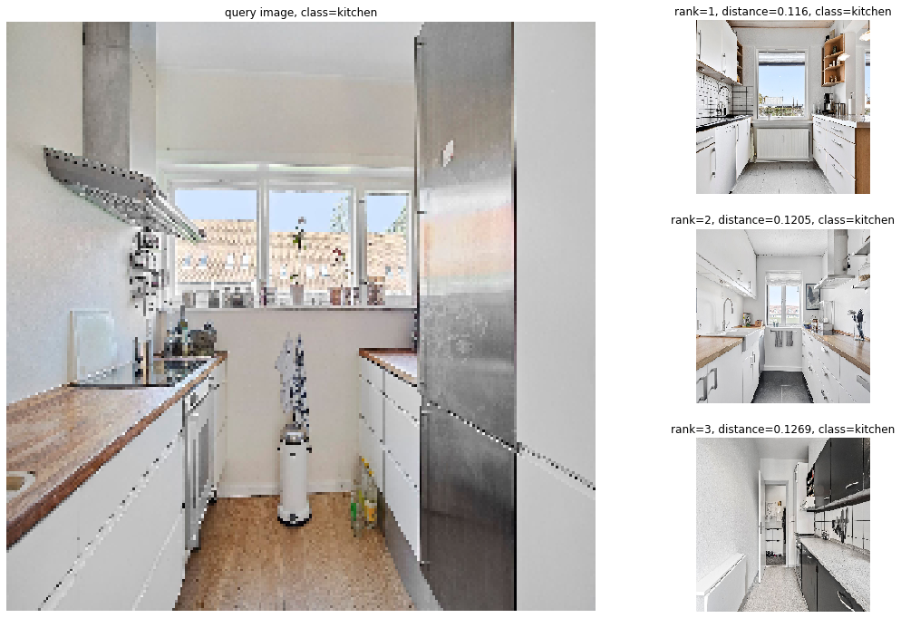
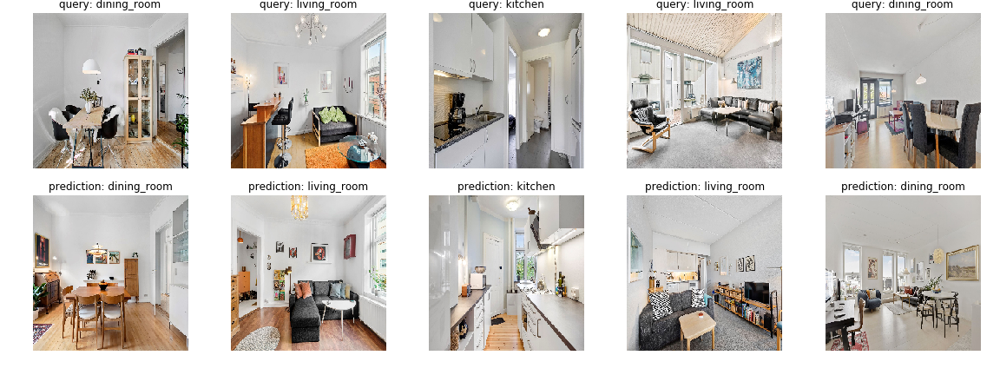

# Transfer-Learned Autoencoders for Visual Similarity
## Image Similarity in the Danish Online Housing Market

> This is my bachelors thesis submission for my BSc in Computer Science @ University of Copenhagen, 2020

### Abstract
This paper investigates the ability of autoencoders to learn meaningful hidden representations from feature vectors of publicly available pretrained neural networks. Several variations of autoencoders are trained in an unsupervised manner to reproduce images collected from the Danish online housing market; these show adeptness in encoding input such that six different classes of rooms are well-separated.

A thorough set of experiments are conducted on the data, showing that some pre- trained networks produce decent predictions out-of-the-box, and that autoencoders can be trained to reduce the dimensionality by a factor of 8 from pretrained feature vectors while improving accuracy in four out of four classification accuracy metrics. Furthermore, a review of the impact of image augmentation procedures is conducted; it is found that model accuracy can be improved by up to 30 percentage points in some models by means of adequate image preprocessing, all else equal.

Methodologies for computing distance coefficients and retrieving similar images given a query image are explored and used in an exposition of the capabilities of pretrained neural networks in comparison to various autoencoder architectures.
Finally, it is established that autoencoders in combination with passes through pretrained neural networks yield useful representations in the encoding layer. These en- coded representations produce a good foundation for determining similarity between images in the domain of the danish housing market.

### Results
#### Overview of Candidate Models

#### t-SNE Visualizations
##### VGG16-AE-512

##### VGG16 Baseline

> The most performant overall candidate model is VGGG16-AE-512. 

### Example Predictions
#### Ranked Predictions

#### Top-1 predictions

